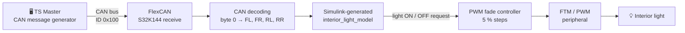
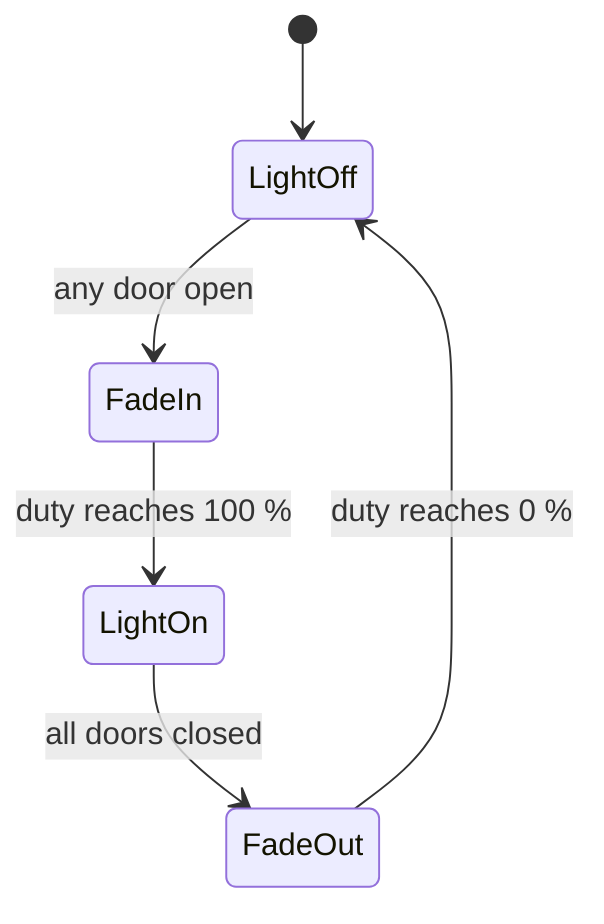
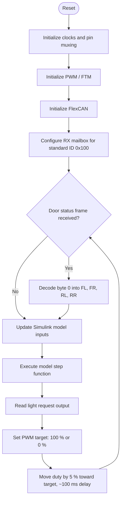

<div align="center">

# CAN-Based Automotive Interior Light Control ECU

### NXP S32K144 · S32 Design Studio · Simulink · FlexCAN · PWM


-green)


**An interior light ECU that reads four door states over CAN, decides the light request with a Simulink-generated model, and drives the lamp with a smooth PWM fade.**

</div>

---

## 📑 Table of Contents

1. [Introduction](#-introduction)
2. [Project Overview and Objectives](#-project-overview-and-objectives)
3. [Key Features](#-key-features)
4. [Hardware and Software Requirements](#-hardware-and-software-requirements)
5. [System Architecture](#-system-architecture)
6. [CAN Protocol Documentation](#-can-protocol-documentation)
7. [Simulink Integration](#-simulink-integration)
8. [PWM Fade-In / Fade-Out](#-pwm-fade-in--fade-out)
9. [Firmware Execution Flow](#-firmware-execution-flow)
10. [Repository Structure](#-repository-structure)
11. [Hardware Testing and Validation](#-hardware-testing-and-validation)
12. [Demo and Media](#-demo-and-media)
13. [Skills Demonstrated](#-skills-demonstrated)
14. [Implemented Features vs. Future Enhancements](#-implemented-features-vs-future-enhancements)
15. [Disclaimer](#-disclaimer)
16. [Authors](#-authors)

---

## 🔎 Introduction

This project implements an **Interior Light Control Electronic Control Unit (ECU)** on the **NXP S32K144** microcontroller using the **ANCIT SmartWheels GenX Micro EV2** development board.

Door status is sent from **TS Master** over a CAN bus. The S32K144 receives the frame with its **FlexCAN** peripheral, decodes the door bits, and feeds them into a **Simulink-generated C model** (`interior_light_model`). The model output selects the light request, and the **PWM** peripheral fades the interior light in or out.

> The project combines three common automotive-development practices: **CAN communication**, **model-based design with generated code**, and **hardware validation on a real MCU board**.

---

## 🎯 Project Overview and Objectives

| # | Objective |
|---|---|
| 1 | Receive door-status CAN messages (ID `0x100`) using the S32K144 FlexCAN peripheral. |
| 2 | Decode a one-byte bitfield into four door states (FL, FR, RL, RR). |
| 3 | Develop the light-request logic in Simulink and integrate the generated C code into an S32DS project. |
| 4 | Drive the interior light with PWM and a gradual fade instead of an abrupt switch. |
| 5 | Configure PWM polarity to match the board's real active-low / active-high behavior and verify it on hardware. |
| 6 | Test the complete chain on physical hardware using TS Master. |

---

## ✨ Key Features

- 🚪 CAN-based monitoring of four doors: **Front Left, Front Right, Rear Left, Rear Right**
- 📨 Standard (11-bit) CAN frame reception on **ID `0x100`**
- 🧮 Door decoding from a **one-byte bitfield**
- 🧩 **Simulink-generated C code** integrated into S32 Design Studio
- 💡 **PWM brightness control** of the interior light
- 🌗 **Fade-in / fade-out** using **5 % duty-cycle steps** with **~100 ms** between steps (≈ 2 s for a full fade)
- 🔧 PWM polarity configured and **validated on the actual board**
- 🖥️ CAN message generation and monitoring with **TS Master**

---

## 🧰 Hardware and Software Requirements

### Hardware

| Component | Purpose |
|---|---|
| NXP S32K144 MCU | Main ECU controller |
| ANCIT SmartWheels GenX Micro EV2 | Development board |
| PWM-compatible interior light / LED driver | Interior light output |
| CAN interface connected to a PC | CAN communication for testing |

### Software and Tools

| Tool | Purpose |
|---|---|
| NXP S32 Design Studio (S32DS) | IDE, build, flash and debug |
| NXP S32 SDK | Peripheral drivers (FlexCAN, PWM/FTM, clocks, pins) |
| MATLAB and Simulink | Interior light logic model |
| Simulink Coder / Embedded Coder | C code generation from the model |
| TS Master | CAN message generation and monitoring |
| Embedded C | Application firmware |
| Git and GitHub | Version control |

---

## 🏗️ System Architecture



---

## 📡 CAN Protocol Documentation

> ⚠️ **This is a custom educational protocol.** It is not an OEM vehicle communication specification.

| Parameter | Value |
|---|---|
| CAN ID | `0x100` |
| Frame type | Standard CAN, 11-bit identifier |
| DLC | 1 byte |
| Payload | Byte 0 = door status bitfield |
| Bitrate | 500 kbps |

> **Bitrate note:** The CAN bitrate must be configured identically in TS Master and in the S32K144 FlexCAN configuration, otherwise frames will not be received.

### Door Bit Mapping (Byte 0)

| Bit | Door | Value `0` | Value `1` |
|:---:|---|---|---|
| 0 | Front Left (FL) | Closed | Open |
| 1 | Front Right (FR) | Closed | Open |
| 2 | Rear Left (RL) | Closed | Open |
| 3 | Rear Right (RR) | Closed | Open |
| 4–7 | Unused | – | – |

### Example CAN Payloads

| Scenario | CAN ID | DLC | Data (hex) | Binary (bits 3..0 = RR RL FR FL) |
|---|:---:|:---:|:---:|:---:|
| All doors closed | `0x100` | 1 | `00` | `0000` |
| FL open | `0x100` | 1 | `01` | `0001` |
| FR open | `0x100` | 1 | `02` | `0010` |
| RL open | `0x100` | 1 | `04` | `0100` |
| RR open | `0x100` | 1 | `08` | `1000` |
| All four doors open | `0x100` | 1 | `0F` | `1111` |

Combinations follow the same rule, for example `0x05` = FL + RL open.

---

## 🧩 Simulink Integration

The interior light logic is developed in **MATLAB/Simulink** and converted to C with **Simulink Coder / Embedded Coder**.

| Item | Description |
|---|---|
| Model | `interior_light_model` |
| Inputs | Four Boolean inputs: `FL`, `FR`, `RL`, `RR` |
| Output | Interior light request (ON / OFF) |
| Logic | `Light = FL OR FR OR RL OR RR` |

**Integration into S32DS**

1. Generate C code from the Simulink model.
2. Add the generated source and header files (`interior_light_model.c` / `.h` and the supporting generated headers) to the S32DS project.
3. In the firmware, write the decoded door bits to the model inputs.
4. Call the model step function on each pass and read the output.
5. Use the output to set the PWM target duty cycle.

If any door is open the model requests the light **ON**; when all doors are closed it requests **OFF**.

---

## 🌗 PWM Fade-In / Fade-Out

The PWM (FTM) peripheral controls brightness. The firmware keeps a **current duty cycle** and moves it step by step toward a **target duty cycle**.

| Condition | Target duty | Behavior |
|---|:---:|---|
| Any door open | 100 % | Fade-in |
| All doors closed | 0 % | Fade-out |

| Parameter | Value |
|---|---|
| Step size | 5 % duty cycle |
| Delay between steps | ≈ 100 ms |
| Steps for a full fade | 100 / 5 = 20 |
| Full fade time | 20 × 100 ms ≈ **2000 ms (≈ 2 s)** |

**Polarity:** The PWM polarity was configured to match the board and light driver's actual active-low / active-high behavior and validated on hardware.

**Implementation note:** The fade is a software ramp using fixed delays between duty updates. It has not been documented as non-blocking in this project (see [Future Enhancements](#-implemented-features-vs-future-enhancements)).



---

## 🔄 Firmware Execution Flow



---

## 📁 Repository Structure


```text
PRO_SH/
├── Includes/            # Compiler / SDK include paths (generated by S32DS)
├── Project_Settings/    # Startup code, linker files
├── SDK/                 # NXP S32 SDK drivers and configuration
├── board/               # Board-level configuration
├── src/
│   ├── main.c                        # Application: CAN receive, decode, model call, PWM fade
│   ├── interior_light_model.c        # Simulink-generated model source
│   ├── interior_light_model.h        # Simulink-generated model header
│   ├── interior_light_model_types.h  # Simulink-generated type definitions
│   └── rtwtypes.h                    # Simulink Coder standard data types
├── Debug_FLASH/         # Build output (generated)
├── doc/                 # Documentation and media
├── PRO_SH.mex           # S32 configuration tools file (pin / peripheral setup)
└── README.md
```

Folder names may differ depending on the S32DS project configuration.

---

## ✅ Hardware Testing and Validation

The system was tested on the actual **S32K144** development board using CAN messages from **TS Master**.

| # | Test case | CAN payload | Expected behavior | Status |
|:-:|---|:---:|---|:---:|
| 1 | All doors closed | `00` | Interior light fades OFF | Tested on hardware |
| 2 | FL opens | `01` | Interior light fades ON | Tested on hardware |
| 3 | FR opens | `02` | Interior light fades ON | Tested on hardware |
| 4 | RL opens | `04` | Interior light fades ON | Tested on hardware |
| 5 | RR opens | `08` | Interior light fades ON | Tested on hardware |
| 6 | Multiple doors open | bits set | Light stays requested ON | Tested on hardware |
| 7 | All doors close again | `00` | Interior light fades OFF | Tested on hardware |
| 8 | PWM polarity check | – | Brightness matches duty cycle on the actual board | Validated on hardware |


---

## 🎬 Demo and Media

**PINS CONFIGURATION**


**PWM CONFIGURATION**


**FLEXCAN CONFIGURATION**


**SIMULINK MODEL**


**TS MASTER TRANSMIT AND TRACE WINDOW**


**DBC FILE IN CANDB++**


**DEMO VIDEO**

▶️ **[Watch the demo video](https://youtu.be/jqoHr25aoh0)**

---

## 🧠 Skills Demonstrated

| Area | Skills |
|---|---|
| Embedded software | Embedded C, NXP S32K144, peripheral configuration with the S32 SDK |
| Communication | CAN / FlexCAN reception, standard frames, bitfield payload decoding |
| Timers and outputs | FTM / PWM configuration, duty-cycle control, polarity handling, pin multiplexing |
| Model-based design | MATLAB / Simulink logic, Simulink Coder / Embedded Coder, generated-code integration |
| Tools | S32 Design Studio, TS Master, Git / GitHub |
| Validation | Hardware bring-up, debugging, CAN-stimulus testing on a real board |

---

## 🚀 Implemented Features vs. Future Enhancements

### ✅ Implemented

- FlexCAN reception of standard ID `0x100` with a one-byte door bitfield
- Door decoding into FL, FR, RL, RR
- Simulink-generated interior light model integrated into S32DS
- PWM output with 5 % duty steps and ~100 ms step delay (≈ 2 s full fade)
- PWM polarity configured and validated on hardware
- Testing on the S32K144 board with TS Master

### 🧭 Proposed (not implemented)

- Non-blocking PWM fading using a periodic timer or scheduler
- 5-second interior light hold time after all doors close
- Immediate cancellation of a fade-out when a door reopens
- Improved CAN receive handling with completion checking and mailbox re-arming
- CAN timeout detection and safe-state handling
- Diagnostic monitoring and fault reporting

---

## ⚖️ Disclaimer

This project was developed for **educational and learning purposes**. The CAN message format is a **custom educational protocol**, not an OEM specification. The project makes no claim of AUTOSAR compliance, ISO 26262 compliance, safety certification, or production-vehicle readiness.

---

## 👥 Authors

| | |
|---|---|
| **Names** | Sivaarunmani G K, Haritha K |
| **Degree** | Electronics and Communication Engineering |
| **Focus** | Automotive Embedded Systems · ECU Development · Model-Based Design |
| **GitHub** | [sivaarunmanigk](https://github.com/sivaarunmanigk) · [harithakanakam7](https://github.com/harithakanakam7) |

---

<div align="center">

⭐ If this project helped you, consider giving the repository a star.

</div>
